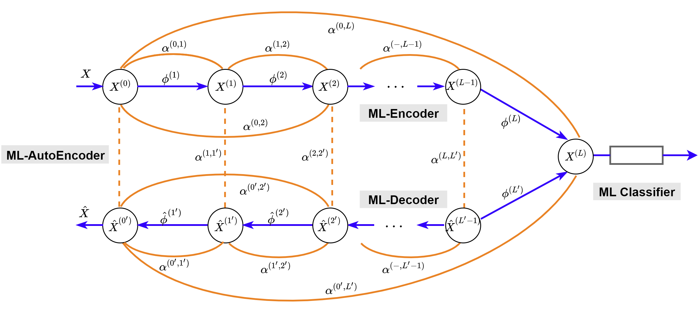

# Markov-Lipschitz Deep Learning (MLDL)

<p align="center">
  
</p>

This is a PyTorch implementation of the 
  [
  MLDL paper
  ](https://arxiv.org/abs/2006.08256)
:
```bibtex
@article{Li-MarLip-2020,
  title={Markov-Lipschitz Deep Learning},
  author={Stan Z Li and Zelin Zang and Lirong Wu},
  journal={arXiv preprint arXiv:2006.08256},
  year={2020}
}
```

The main features of MLDL for manifold learning and generation in comparison to other popular methods are summarized below:
<p align="center">
	
</p>

The code includes the following modules:
* Datasets (Swiss rool, S-Curve, MNIST, Spheres)
* Training for ML-Enc and ML-AE (ML-Enc + ML-Dec)
* Test for manifold learning (ML-Enc) 
* Test for manifold generation (ML-Dec) 
* Visualization
* Evaluation metrics 
* The compared methods include: AutoEncoder (AE), <a href="https://github.com/BorgwardtLab/topological-autoencoders">Topological AutoEncoder (TopoAE)</a>, [Modified Locally Linear Embedding (MLLE)](https://github.com/scikit-learn/scikit-learn), [ISOMAP](https://github.com/scikit-learn/scikit-learn), [t-SNE](https://github.com/scikit-learn/scikit-learn). (Note: We modified the original TopoAE source code to make it able to run the Swiss roll dataset by adding a swiss roll dataset generation function and modifying the network structure for fair comparison.)

## Requirements

* pytorch == 1.3.1
* scipy == 1.4.1
* numpy == 1.18.5
* scikit-learn == 0.21.3
* csv == 1.0
* matplotlib == 3.1.1
* imageio == 2.6.0

## Description

* main.py  
  * SetParam() -- Parameters for training
  * train() -- Train a new model (encoder and/or decoder)
  * autotrain() -- Training 10 models, each with different seed
  * Generation() -- Testing generation of new data of the learned manifold
  * Generalization() -- Testing dimension reduction from unseen data of the learned manifold
  * onlinePlot() -- online plot intermediate results during training
* dataset.py  
  * LoadData() -- Load data of selected dataset
* loss.py  
  * MLDL_Loss() -- Calculate six losses: ℒ<sub>Enc</sub>, ℒ<sub>Dec</sub>, ℒ<sub>AE</sub>, ℒ<sub>lis</sub>, ℒ<sub>push</sub>, ℒ<sub>ang</sub>  
* model.py  
  * Encoder() -- For latent feature extraction
  * Decoder() -- For generating new data on the learned manifold 
* eval.py -- Calculate performance metrics from results, each being the average of 10 seeds
* utils.py  
  * GIFPloter() -- Auxiliary tool for online plot
  * GetIndicator() -- Auxiliary tool for evaluating metric 
  * Sampling() -- Sampling in the latent space for generating new data on the learned manifold 

## Running the code

1. Clone this repository

  ```
  git clone https://github.com/westlake-cairi/Markov-Lipschitz-Deep-Learning
  ```

2. Install the required dependency packages

3. To get the results for 10 seeds, run

  ```
python main.py -Auto
  ```

4. To choose a dataset among SwissRoll, Scurve, 7MNIST, 10MNIST and Spheres5500, run

  ```
  python main.py -D "dataset name"
  ```

5. To get the metrics for ML-Enc and ML-AE, run

  ```
  python eval.py -M ML-Enc
  python eval.py -M ML-AE
  ```
The evaluation metrics are available in `./pic/indicators.csv`

6. To test the generalization to unseen data, run
  ```
  python main.py -M Test
  ```
The results are available in `./pic/file_name/Test.png`

7. To test the manifold generation, run
  ```
  python main.py -M Generation
  ```
The results are available in `./pic/file_name/Generation.png`

## Results

1. Visualization of embeddings
* Swiss Roll and S-Curve

   A symbol √ or X represents a success or failure in unfolding the manifold. From the figure below, we can see that the ML-Enc not only succeeds but also best maintains the true aspect ratio.
  
  

* MNIST(left) and Spheres(right)

	 As shown in the figure, ML-Enc performs well on both training and testing data set. In addition, the embedding produced by ML-Enc is either better than others or comparable to them.
   
  


2. Performance metrics on Swiss Roll (800 points) data

   This table demonstrates that the ML-Enc outperforms all the other 6 methods in all the evaluation metrics, particularly significant in terms of the isometry (LGD, RRE and Trust) and Lipschitz (*K*-Min and *K*-Max) related metrics. 

   |        | #Succ | L-KL   | RRE      | Trust  | LGD     | K-Min | K-Max   | MPE    |
   | ------ | ----- | ------ | -------- | ------ | ------- | ----- | ------- | ------ |
   | ML-Enc | 10    | 0.0184 | 0.000414 | 0.9999 | 0.00385 | 1.00  | 2.14    | 0.0262 |
   | MLLE   | 6     | 0.1251 | 0.030702 | 0.9455 | 0.04534 | 7.37  | 238.74  | 0.1709 |
   | HLLE   | 6     | 0.1297 | 0.034619 | 0.9388 | 0.04542 | 7.44  | 218.38  | 0.0978 |
   | LTSA   | 6     | 0.1296 | 0.034933 | 0.9385 | 0.04542 | 7.44  | 215.93  | 0.0964 |
   | ISOMAP | 6     | 0.0234 | 0.009650 | 0.9827 | 0.02376 | 1.11  | 34.35   | 0.0429 |
   | t-SNE  | 0     | 0.0450 | 0.006108 | 0.9987 | 3.40665 | 11.1  | 1097.62 | 0.1071 |
   | LLE    | 0     | 0.1775 | 0.014249 | 0.9753 | 0.04671 | 6.17  | 451.58  | 0.1400 |


3. Generalization testing

   The learned ML-Enc network can unfold unseen data of the learned manifold whereas the compared methods cannot.  


4. Visualization of ML-AE training evolution

   The gif below shows the evolution of the process that ML-AE gradually unfolds the manifold in each layer of the encoder, learning the optimal embedding in the latent space and then reconstruct it in the mirrored symmetric layers of the decoder during the training.
<p align="center">
 
</p>
