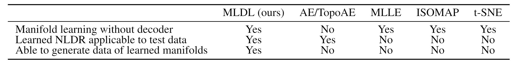
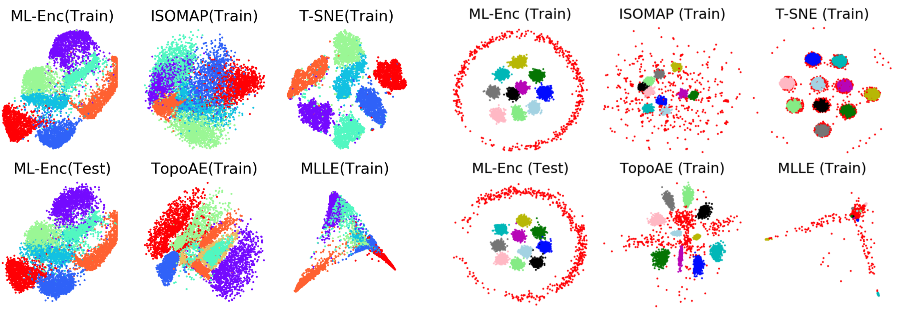
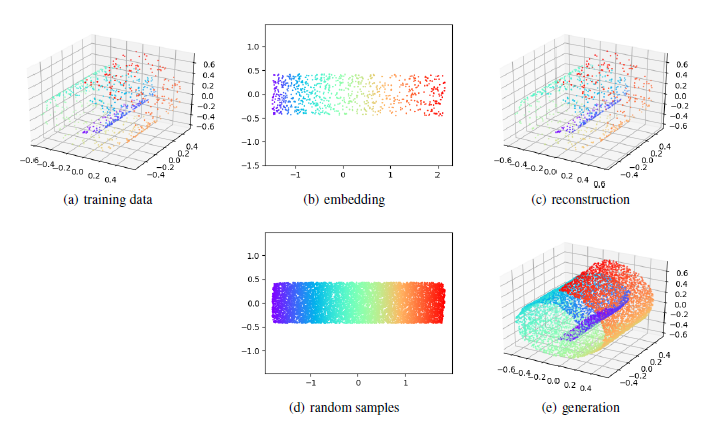
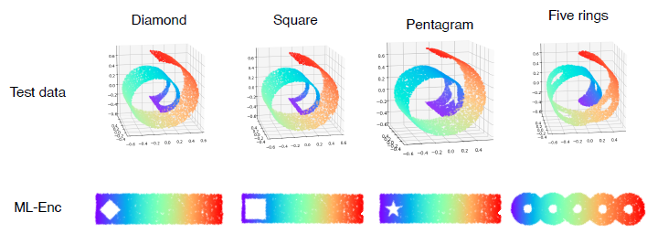

# Markov-Lipschitz Deep Learning (MLDL)

## Summary

This is the PyTorch code for the following paper:

[
Stan Z. Li, Zelin Zang, Lirong Wu, "Markov-Lipschitz Deep Learning", arXiv preprint, arXiv:2006.08256, 2020.
](https://arxiv.org/abs/2006.08256)

Main features of MLDL for manifold learning and generation in comparison with some others are summarized below:


The code includes the following modules:
* Datasets (Swiss rool, S-Curve, MNIST, Spheres)
* Training for ML-Enc and ML-AE (ML-Enc + ML-Dec)
* Test for manifold learning (ML-Enc) 
* Test for manifold generation (ML-Dec) 
* Visualization
* Evaluation metrics 
* Compared methods include: AutoEncoder (AE), <a href="https://github.com/BorgwardtLab/topological-autoencoders">Topological AutoEncoder (TopoAE)</a>, [Modified Locally Linear Embedding (MLLE)](https://github.com/scikit-learn/scikit-learn), [ISOMAP](https://github.com/scikit-learn/scikit-learn), [t-SNE](https://github.com/scikit-learn/scikit-learn). (Note: We modified the original TopoAE source code to make it able to run the Swiss roll dataset by adding a swiss roll dataset generation function and modifying the network structure for fair comparison.)

## Requirements

* pytorch == 1.3.1
* scipy == 1.4.1
* numpy == 1.18.5
* scikit-learn == 0.21.3
* csv == 1.0
* matplotlib == 3.1.1
* imageio == 2.6.0

## Description

* main.py  
  * SetParam() -- Parameters for training
  * train() -- Train a new model (encoder and/or decoder)
  * autotrain() -- training 10 models, each with different seed
  * onlinePlot() -- online plot intermediate resuts
* dataset.py  
  * LoadData() -- Load data of selected dataset
* loss.py  
  * MLDL_Loss() -- Calculate six losses: ℒ<sub>Enc</sub>, ℒ<sub>Dec</sub>, ℒ<sub>AE</sub>, ℒ<sub>lis</sub>, ℒ<sub>push</sub>, ℒ<sub>ang</sub>  
* model.py  
  * Encoder() -- for latent feature extraction
  * Decoder() -- for generating new data on the learned manifold 
* eval.py -- Calculate performance metrics from results, each being the average of the 10
* utils.py  
  * GIFPloter() -- Auxiliary tool for PlotLatenSpace() 
  * GetIndicator() -- Auxiliary tool for evaluating metric 
  * Sampling() -- Samping in the latent space for generating new data on the learned manifold 

## Running the code

1. Clone this repository

  ```
  git clone https://github.com/westlake-cairi/westlake-cairi-MAE_TESTREBAR/tree/New_Codes
  ```

2. Install the required dependency packages

3. To get the results for 10 seeds, run

  ```
  python autotrain.py
  ```

4. To get the metrics for ML-Enc and ML-AE, run

  ```
  python eval.py -M ML-Enc
  python eval.py -M ML-AE
  ```
The evaluation metrics are available in `./pic/indicators.csv`

5. To test the generalization to unseen data, run
  ```
  python main.py -M Test
  ```
The results are available in `./pic/Epoch_10000_test.png`

5. To test the manifold generation, run
  ```
  python main.py -M Generation
  ```
The results are available in `./pic/Generation.png`

## Results

1. Visualization of embeddings
* Swiss Roll and S-Curve

   A symbol √ or X represents a success or failure in unfolding the manifold. From the figure below, we can see that the ML-Enc not only succeeds but also best maintains the true aspect ratio.
  
  

* MNIST(left) and Spheres(right)

	 As shown in the figure, ML-Enc performs well on both training and testing data set. In addition, the embedding produced by ML-Enc is either better than others or comparable to them.
   
  


2. Comparison of embedding quality for Swiss Roll (800 points)

   This table demonstrates that the ML-Enc outperforms all the other 6 methods in all the evaluation metrics, particularly significant in terms of the isometry (LGD, RRE and Trust) and Lipschitz (*K*-Min and *K*-Max) related metrics. 

   |        | #Succ | L-KL   | RRE      | Trust  | LGD     | K-Min | K-Max   | MPE    |
   | ------ | ----- | ------ | -------- | ------ | ------- | ----- | ------- | ------ |
   | ML-Enc | 10    | 0.0184 | 0.000414 | 0.9999 | 0.00385 | 1.00  | 2.14    | 0.0262 |
   | MLLE   | 6     | 0.1251 | 0.030702 | 0.9455 | 0.04534 | 7.37  | 238.74  | 0.1709 |
   | HLLE   | 6     | 0.1297 | 0.034619 | 0.9388 | 0.04542 | 7.44  | 218.38  | 0.0978 |
   | LTSA   | 6     | 0.1296 | 0.034933 | 0.9385 | 0.04542 | 7.44  | 215.93  | 0.0964 |
   | ISOMAP | 6     | 0.0234 | 0.009650 | 0.9827 | 0.02376 | 1.11  | 34.35   | 0.0429 |
   | t-SNE  | 0     | 0.0450 | 0.006108 | 0.9987 | 3.40665 | 11.1  | 1097.62 | 0.1071 |
   | LLE    | 0     | 0.1775 | 0.014249 | 0.9753 | 0.04671 | 6.17  | 451.58  | 0.1400 |

   

3. Performance metrics for the ML-AE with Swiss Roll (800 points) data

   While the other 3 autoencoders fail to unfold the manifold data sets, the ML-AE produces good quality results especially in terms of the isometry and Lipschitz related metrics. 

   |        | #Succ | L-KL    | RRE     | Trust  | Trust   | K-min | K-max   | MPE     | MRE     |
   | ------ | ----- | ------- | ------- | ------ | ------- | ----- | ------- | ------- | ------- |
   | ML-AE  | 10    | 0.00165 | 0.00070 | 0.9998 | 0.00514 | 1.01  | 2.54    | 0.04309 | 0.01846 |
   | AE     | 0     | 0.11537 | 0.13589 | 0.7742 | 0.03069 | 1.82  | 5985.74 | 0.01519 | 0.40685 |
   | VAE    | 0     | 0.23253 | 0.49784 | 0.5053 | 0.04000 | 1.49  | 5290.55 | 0.01977 | 0.78104 |
   | TopoAE | 0     | 0.05793 | 0.04891 | 0.9265 | 0.09651 | 1.10  | 228.11  | 0.12049 | 0.56013 |


4. The process of manifold data reconstruction and generation using ML-AE

   In the learning phase, the ML-AE taking (a) the training data as input, output (b) embedding in the learned latent space, and then reconstruct back (c). In the generation phase, the ML-Dec takes (d) random input samples in the latent space, and maps the samples to the manifold (e).




5. Generalization testing

   The unseen manifold data sets are well unfolded by the ML-Enc and the removed shapes are kept very well, illustrating that the learned ML-Enc has a good ability to generalize to unseen data. 




6. Visualization of ML-AE training evolution

   The gif below shows the evolution of the process that ML-AE gradually unfolds the manifold in each layer of the encoder, learning the optimal embedding in the latent space and then reconstruct it in the mirrored symmetric layers of the decoder during the training.
<center>
  
</center>

## Citation


```bibtex
@article{Li-MarLip-2020,
  title={Markov-Lipschitz Deep Learning},
  author={Stan Z Li and Zelin Zang and Lirong Wu},
  journal={arXiv preprint arXiv:2006.08256},
  year={2020}
}
```
